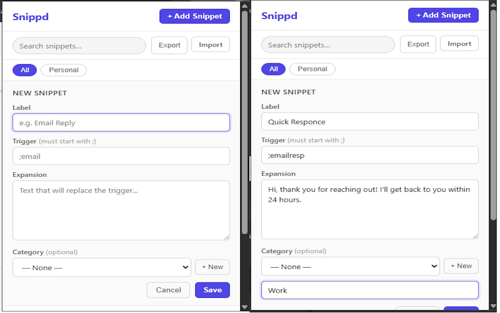
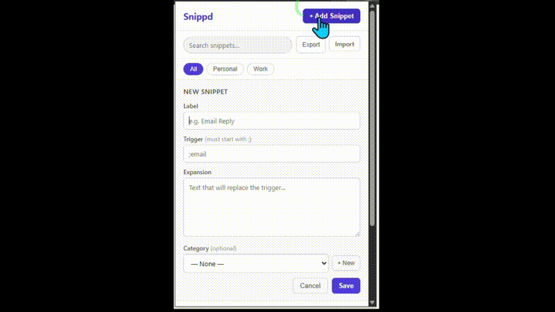

# Snippd 
### Type less. Say more.

Snippd is a free, open source Chrome extension that expands short trigger words into full blocks of text  instantly, on any website.

Type `;email`  get your full email template. Type `;addr`  get your full address. One keystroke saves you paragraphs of typing.

---

##  Screenshots




---

##  Features

- **Instant expansion**  type a trigger, get full text immediately
- **Works everywhere**  Gmail, Google Docs, Twitter, LinkedIn, any text field
- **100% local**  no accounts, no servers, no cloud. Your snippets never leave your device
- **Free forever**  no paywalls, no subscriptions, no catch
- **Lightweight**  no frameworks, no bloat, just fast

---

##  Install

### From the Chrome Web Store
*(coming soon?)*
 <!-- [Install Snippd](https://chromewebstore.google.com/detail/snippd) *(update link after approval)* -->

### From Source
1. Clone this repo
   ```bash
   git clone https://github.com/runandhide05/Snippd.git
   ```
2. Open Chrome and go to `chrome://extensions`
3. Enable **Developer Mode** (top right toggle)
4. Click **Load Unpacked**
5. Select the `snippd/` folder
6. Done  Snippd appears in your toolbar

---

##  How to Use

1. Click the Snippd icon in your Chrome toolbar
2. Add a snippet  give it a trigger word starting with `;` and your expansion text
3. Go to any webpage with a text field
4. Type your trigger (e.g. `;email`) and watch it expand instantly

### Example Snippets

| Trigger | Expands To |
|---------|-----------|
| `;email` | Hi, thank you for reaching out! I'll get back to you within 24 hours. |
| `;addr` | 123 Main Street, Springfield, IL 62701 |
| `;sig` | Best regards, John Smith \| john@email.com \| (555) 123-4567 |
| `;ty` | Thank you so much for your time, I really appreciate it! |
| `;meet` | Would you be available for a quick 15 minute call this week? |

---

### Dynamic Variables

Add live values to any snippet using `{{variable}}` placeholders - they're replaced with the current date, time, and more the moment you expand the trigger.

| Variable | Example Output |
|----------|---------------|
| `{{date}}` | April 4, 2026 |
| `{{date:MM/DD/YY}}` | 04/04/26 |
| `{{time}}` | 2:30 PM |
| `{{datetime}}` | April 4, 2026, 2:30 PM |
| `{{day}}` | Saturday |
| `{{month}}` | April |
| `{{year}}` | 2026 |
| `{{cursor}}` | *(places your cursor here after expansion)* |

**Example** - a snippet with trigger `;note` and expansion:
```
{{date}} - 
{{cursor}}
```
Expands to today's date on the first line, with your cursor ready to type on the second line.

---

##  Roadmap

### V1  Live 
- [x] Create, edit, delete snippets
- [x] Trigger expansion on any webpage
- [x] Works in Gmail, Google Docs, standard inputs
- [x] 100% local storage  no server needed

### V2  Live 
- [x] Folders and categories
- [x] Search and filter snippets
- [x] Import / export snippets as JSON
- [x] Keyboard shortcut to open popup (type ;snippd on any page)
- [x] Snippet usage counter

### V3  Live 
- [x] Dynamic variables - `{{date}}`, `{{time}}`, `{{datetime}}`, `{{day}}`, `{{month}}`, `{{year}}`, `{{cursor}}`
- [x] UI redesign - snippet cards, gradient header, expansion previews

---

##  Contributing

Contributions are welcome! Snippd is intentionally simple  please keep that spirit when submitting PRs.

1. Fork the repo
2. Create a branch (`git checkout -b feature/my-feature`)
3. Make your changes
4. Submit a pull request

For bugs or feature requests, open an [Issue](https://github.com/runandhide05/Snippd/issues).

Please keep contributions focused  no frameworks, no build tools, no unnecessary dependencies. Vanilla JS only.

---

##  Tech Stack

| Layer | Tech |
|-------|------|
| Extension API | Chrome Manifest V3 |
| Storage | chrome.storage.local |
| UI | Vanilla HTML + CSS + JS |
| Content Script | Vanilla JS |
| Backend | None  intentionally |

---

##  Privacy

Snippd collects **zero data.** 

- No analytics
- No tracking
- No accounts
- No network requests
- All snippets are stored locally on your device using `chrome.storage.local`
- Nothing ever leaves your browser

---

##  Support

Snippd is and always will be free. If it saves you time every day, consider buying me a coffee  it keeps the project alive and motivates future updates.

 [Support Snippd on Ko-fi](https://ko-fi.com/runandhide05)

---

##  License

MIT License  free to use, modify, and distribute. See [LICENSE](LICENSE) for details.

---

*Built with coffee and a desire to type less.*
